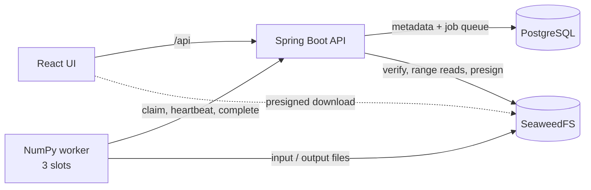

# Tensor Workbench

Bounded, asynchronous processing of **synthetic** 3D arrays. Generate an input tensor, run a parameter
sweep on a fixed three-slot worker pool, inspect heatmap slices, and download full results.

> The computation is a toy function (`output = gain × coefficient[material_code] + bias`), not a
> physics solver. The project is about the engineering around expensive array workloads: capacity limits,
> retries, artifact storage, and getting large results to a browser.


**Stack:** Kotlin + Spring Boot · Python + NumPy · PostgreSQL · SeaweedFS (S3) · React + TypeScript · Docker Compose

## Run locally

**Prerequisites:** Docker with Compose v2. To run the test suites outside Docker you also need JDK 17+,
[uv](https://docs.astral.sh/uv/) and Node 22+.

**1. Start the stack.** This builds and starts Postgres, SeaweedFS, the API, the worker and the UI, then
waits until everything is healthy. The first build takes a few minutes; later starts take seconds.

```bash
docker compose up --build --wait
```

**2. Try it** at http://localhost:3000 (API docs at `/api/docs`):

1. *Generate an input tensor:* keep 128×128×128, seed 42, then click **Generate dataset**.
2. *Submit work:* gain 1 → 20, step 1, *Demo* checked, then click **Submit sweep (20 runs)**.
3. *Monitor:* the three slot dots fill and the timeline never exceeds three lanes. Child #3 fails (red),
   then succeeds on retry as `#3·2`.
4. *Inspect a result:* click a finished row, scrub the slice slider (X/Y/Z), then click **Download full
   result**.

**3. Scripted demo (optional).** Runs the same flow from the CLI and checks the downloaded file's SHA-256.

```bash
./scripts/demo.sh
```

**4. Run the tests** (commands are in the [Tests](#tests) table). The API tests start their own
throwaway containers, so Docker must be running. The end-to-end tests need the stack from step 1.

**5. Try the failure handling.** During a sweep, simulate a crash:

```bash
docker compose kill -s SIGKILL worker
docker compose start worker
```

Finished runs stay intact, and interrupted runs are retried after their 15 s lease expires.
`docker compose restart worker` (a graceful stop) hands work back immediately instead.

**6. Stop.** `docker compose down` stops the stack; add `-v` to delete all data.

## How it works



- **Queue:** PostgreSQL, claiming with `FOR UPDATE SKIP LOCKED` in short transactions. No transaction stays open while work runs.
- **Capacity:** one worker service with 3 slot processes. A slot claims only after its previous task stops.
- **Runs vs attempts:** retries stay under one run, and `accepted_attempt_id` marks the authoritative result.
- **Leases and fencing:** heartbeat, complete and fail require the current, unexpired lease token. Stale
  workers get `409`, and object keys are scoped to each attempt, so a stale upload can't overwrite anything.
- **Retries:** transient errors back off exponentially with jitter (3 attempts). Invalid input,
  unsupported versions and out-of-memory errors fail immediately. Failed runs can be retried explicitly.
- **Idempotency:** each submission sends an `Idempotency-Key`. The same payload returns the original
  resource; a different payload returns `409`.
- **Large results:** tensors are `.npy` files in object storage, and the database stores only their keys.
  Previews are pre-rendered slices (at most 128×128, 8-bit), each served with one byte-range read. Full
  downloads use presigned URLs. A 20-run sweep stores 160 MiB; browsing it transferred about 318 KiB.

Details: [docs/DESIGN.md](docs/DESIGN.md).

## Tests

| Suite | Command | Result |
|---|---|---|
| API (real Postgres + SeaweedFS via Testcontainers) | `cd api && ./gradlew test` | 32 passed |
| Worker | `cd worker && uv run pytest` | 24 passed |
| Web | `cd web && npm ci && npm test` | 9 passed |
| End-to-end (against the running stack) | `cd e2e && uv run pytest` | 9 passed |

The end-to-end suite checks that 20 variants peak at 3 simultaneous computations, the demo retry,
idempotency, downloads that match value for value, and recovery after the worker is killed. CI runs all
four suites.

## Measurements

Apple M4 Pro, Docker Desktop, single runs:

- **Worker only, 512³ (134M elements):** compute 1.3 s; peak anonymous memory 41 MiB (memory-mapped file
  pages reached about 1 GiB).
- **Full stack, no synthetic delay:** a 20-run sweep took 2.3 s at 128³ and 5.4 s at 256³. The demo adds a
  labelled 3 s delay per run so the scheduling is visible.

## Limitations

- The computation is synthetic and makes no scientific claims.
- The capacity limit is per worker process, not global.
- No authentication; development credentials only.
- Downloads assume the browser can reach `localhost:8333`.
- One implementation version at a time. Previews are lossy.
