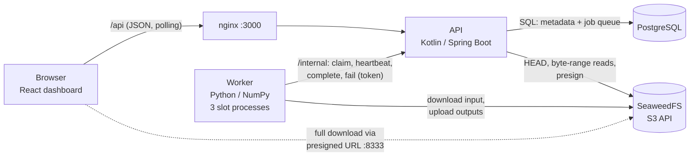
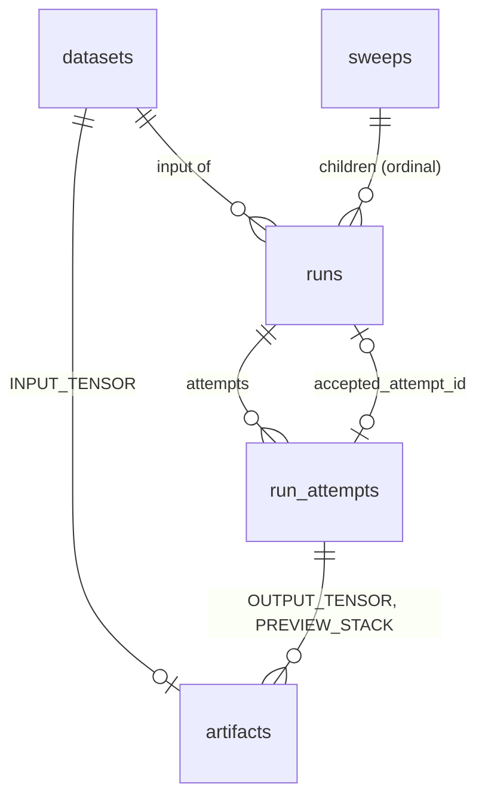

# Tensor Workbench

A small full-stack application that runs **synthetic** numerical workloads on 3D arrays with
bounded worker capacity, retries, large-artifact storage and compact result visualization.

You generate a reproducible integer tensor, submit one computation or a parameter sweep, watch at most
three computations run at once, inspect a heatmap slice of any result, and download the full output.

> **The computation is a documented toy function, not a physics solver.** It exists to exercise the
> engineering around expensive array workloads: asynchronous execution, capacity limits, failure
> handling, artifact storage, and getting large results to a browser without sending the whole array.
> Nothing here claims scientific accuracy, GPU scheduling, or production readiness.


**Stack:** Kotlin + Spring Boot 4 (API) · Python + NumPy (worker pool) · PostgreSQL 18 (metadata and job
queue) · SeaweedFS (S3-compatible artifacts) · React + TypeScript + Vite (dashboard) · Docker Compose.

---

## Quick start

Prerequisites: Docker with Compose v2 (tested with Docker 29.8 / Compose 5.5). Nothing else is needed to
run the demo, and no cloud credentials or paid services are involved.

```bash
docker compose up --build --wait
```

Then open **http://localhost:3000**. The first build downloads images and dependencies. Later starts take
seconds. Schema migrations run automatically (Flyway) and the storage bucket is created automatically.

| Port (localhost only) | What |
|---|---|
| `3000` | Dashboard, plus the public API under `/api` (OpenAPI UI at `/api/docs`) |
| `8333` | SeaweedFS S3 endpoint, published so browsers can follow presigned download URLs |

The API container is not published: its `/internal` worker endpoints stay on the Compose network.

For a scripted command-line version of the demo, which ends by checksumming a downloaded result:

```bash
./scripts/demo.sh
```

To reset all data: `docker compose down -v`.

## Two-minute demo script

1. **(0:00) Frame it.** "A synthetic stand-in for an expensive array workload. The interesting parts are
   the scheduling, failure handling and data movement, not the math." Point at the disclaimer and the
   three worker-slot dots in the header.
2. **(0:15) Generate an input.** Keep 128 × 128 × 128, seed 42. The form shows the element count and the
   raw sizes (8 MiB int32 in, 8 MiB float32 out per run) before anything is created. Click
   *Generate dataset*; it becomes *Ready* in about a second.
3. **(0:30) Submit a sweep.** gain from 1 to 20, step 1: the form previews exactly 20 variants. Leave
   *Demo: one child fails transiently* checked. Click *Submit sweep*. The API answers `202` immediately;
   the work is queued in PostgreSQL.
4. **(0:45) Watch bounded execution.** All three slot dots fill, the counts show queued, running and
   succeeded, and the timeline never grows past three lanes. Child **#3** turns red: its first attempt
   failed with a `TRANSIENT` error. It is requeued with backoff and reappears later as **#3·2**. The table
   fills in partial results while the rest are still running.
5. **(1:15) Inspect a result.** Click a finished row. Summary stats appear, plus a heatmap of one slice.
   Drag the slider and switch between X, Y and Z. Each move fetches one pre-rendered slice of at most
   128 × 128 bytes (about 22 KB of JSON), never the 8 MiB array. Hover a pixel to read its approximate value.
6. **(1:35) Download.** Click *Download full result*. The API redirects to a short-lived presigned URL and
   the browser downloads the complete `.npy` straight from object storage.
7. **(1:50) Close.** "Twenty full results are stored, about 160 MiB. The browser moved about 300 KiB to
   browse all of them." Optionally run `docker compose kill -s SIGKILL worker` during a sweep, then
   `docker compose start worker`: unfinished work is recovered after its lease expires, and finished
   results are untouched.

## Architecture



* **The API never handles tensor bytes.** It stores metadata and queue state, checks uploads with `HEAD`,
  reads preview slices as small byte ranges, and signs download URLs.
* **The worker never touches PostgreSQL.** It talks to the API over a small internal HTTP protocol and to
  storage through a two-method interface (`download_file`, `upload_file`).
* **A job message carries references, not data:** object keys, a SHA-256 checksum and an immutable
  configuration snapshot.

### The computation (`affine-material-map` 1.0.0)

| | Shape | Type | Content |
|---|---|---|---|
| Input | `(X, Y, Z)` | `int32` | Material codes 0–7 from generator `layered-inclusions-1` (seeded) |
| Output | `(X, Y, Z)` | `float32` | `gain × COEFFICIENTS[code] + bias` |

`COEFFICIENTS` is a fixed, made-up 8-entry table. The generator draws a base plate, a thin film, a cap
layer, vertical vias and a few spherical inclusions from a PCG64 generator seeded with the dataset
seed. Each voxel depends only on its own coordinates, so the output is identical for any slab size (a
test checks this). Because the map is pointwise, the worker processes one slab of axis-0 planes at a time
(2 MiB by default). Memory per slot is bounded by the slab, not the tensor. Artifacts are uncompressed
`.npy` files: the worker streams the input to a local temp file, memory-maps it, writes the output through
`numpy.lib.format.open_memmap`, computes min/max/mean/std with a streaming (Chan et al.) update, and
deletes its temp directory afterwards.

## Data model and run semantics



* A **run** is one logical request: a dataset, parameters, an implementation version and a config hash.
  A **run attempt** is one execution of it. Retries stay under the same run. A new parameter or
  version means a new run, and earlier successful outputs are kept.
* `runs.accepted_attempt_id` points to the **authoritative** attempt. A composite foreign key guarantees it
  belongs to the same run, and a partial unique index allows **at most one open attempt per run**. The UI
  always shows the accepted attempt, never "whichever file finished writing last".
* Artifacts are owned by a dataset (input) or by the attempt that produced them (output, preview). A
  `CHECK` constraint ties the owner to the artifact kind. The tables store **object keys, never URLs**.
* **Idempotency:** every submission carries an `Idempotency-Key`. The key row
  `(operation, key, request_hash, resource_id)` is inserted in the same transaction that creates the
  resource. Same key and same normalized payload returns the original resource (`202`,
  `Idempotent-Replayed: true`). Same key with a different payload returns `409 IDEMPOTENCY_KEY_REUSED`.
  The primary key makes concurrent duplicates serialize. The UI reuses a key only after an ambiguous
  failure (network error or 5xx) and generates a new one for a deliberate new submission.
* **Versions are pinned:** the snapshot records `implementationVersion`, the API rejects versions the
  deployed worker does not implement, and the worker refuses a mismatched snapshot.

```text
run:      QUEUED ──claim──▶ RUNNING ──complete (fenced)──▶ SUCCEEDED
            ▲                  │
            │  transient,      │  permanent, or attempts exhausted
            └─ backoff ────────┤
                               ▼
                             FAILED ──explicit retry──▶ QUEUED (budget extended, numbering continues)

attempt:  open (leased) ──▶ SUCCEEDED | FAILED | LEASE_EXPIRED
```

### Useful query: the authoritative output for a dataset

```sql
SELECT r.id AS run_id, r.gain, r.bias, r.implementation_version, a.attempt_number,
       o.object_key, o.size_bytes, o.sha256, a.summary
FROM runs r
JOIN run_attempts a ON a.id = r.accepted_attempt_id
JOIN artifacts o    ON o.attempt_id = a.id AND o.kind = 'OUTPUT_TENSOR'
WHERE r.dataset_id = :dataset_id
ORDER BY r.created_at;
```

## Queue, capacity, leases and fencing

* **PostgreSQL is the queue.** A claim is one short transaction (`UPDATE … FROM (SELECT … FOR UPDATE SKIP
  LOCKED LIMIT 1)`) that is committed before the worker does any network or numerical work. No
  transaction is held open during a computation. Retries become eligible at `next_attempt_at`, so backoff
  is enforced by the same query that gives FIFO order.
* **Three-slot assumption.** The supported topology is **one worker service with a fixed pool of three
  slot processes** (`WORKER_SLOTS`, default 3). Each slot claims a task only after its previous one has
  stopped, so one worker process never runs more than three computations. This is a CPU worker-pool
  demonstration. Starting more worker replicas would multiply capacity; a global quota (for example, a
  shared GPU pool) is out of scope and noted below. The worker logs `compute_start` and `compute_end`
  events with a cross-process counter, and the timeline API computes peak overlap from the reported
  compute intervals. Both are used to verify the bound.
* **Leases and fencing tokens.** Every claim gets a lease (15 s) and a token from a global increasing
  sequence. The worker heartbeats every 5 s. Heartbeat, complete and fail all require the token of the
  **open, unexpired** attempt; anything else gets `409 LEASE_NOT_HELD` and changes nothing. A recovery job
  closes expired attempts as `LEASE_EXPIRED` and applies the retry policy.
* **What expiry can and cannot do.** Lease expiry cannot stop a paused or partitioned worker. Workers stop
  when a heartbeat is rejected (they check between slabs), and **fencing protects accepted state** if a
  stale worker wakes up. Object keys are scoped to the attempt (`runs/{run}/attempt-{n}-{token}/…`), so a
  stale upload can never overwrite another attempt's files.
* **Publication.** The worker uploads its output and preview (with SHA-256 in object metadata), then calls
  complete. The API checks each object with `HEAD` (exists, size, checksum metadata, correct prefix)
  **outside** any transaction. It then runs one conditional transaction that closes the attempt, sets
  `accepted_attempt_id` and records the artifacts. There is **no atomic transaction across PostgreSQL and
  object storage**: an attempt that uploads and then loses its lease leaves unreferenced objects. These
  orphans are never served, and
  `docker compose exec worker python -m tensor_worker.admin cleanup-orphans [--delete]` lists or removes
  them after a grace period.

### Failure classification

| Category | Retried automatically? | Example |
|---|---|---|
| `TRANSIENT` | yes, exponential backoff with jitter (2 s base, 60 s cap), 3 attempts | storage or API timeout, 5xx, the demo fault |
| `LEASE_EXPIRED` | yes | worker crashed or partitioned |
| `WORKER_SHUTDOWN` | yes | graceful stop during a deploy |
| `INVALID_INPUT` | no | codes outside 0–7, checksum mismatch, bad `.npy` header |
| `UNSUPPORTED_VERSION` | no | snapshot asks for a version the worker does not implement |
| `RESOURCE_EXHAUSTED` | no | `MemoryError`: the unchanged request would fail again |
| `INTERNAL` | no | unexpected bug |

After the automatic budget runs out, the failure details stay on the run and its attempts.
`POST /api/runs/{id}/retry` (or *Retry N failed* on a sweep) requeues only `FAILED` runs. Succeeded
children are never duplicated.

## Getting results to the browser

**Storing every output is not the same as sending every output to the browser.** A 20-variant sweep at
128³ stores 20 × 8 MiB = 160 MiB of float32 results. The dashboard needs only a few hundred bytes of
summary per run and one small image at a time.

* **Summaries** (min, max, mean, std, compute time, size) are computed by the worker while streaming and
  stored as JSON on the attempt. The paginated results table reads only those.
* **Slice previews (chosen approach).** After computing, the worker pre-renders *every* slice along all
  three axes. Each slice is downsampled to at most **128 × 128** (nearest-neighbour) and quantized to
  8 bits using the run's global min/max. All slices go back to back in one `PREVIEW_STACK` object. The API
  serves a slice with **one S3 byte-range read** of at most 16 KiB and marks it immutable, so the browser
  caches revisits. *Tradeoff:* extra storage (6 MiB per 128³ run, 24 MiB at 512³) and lossy pixels; in
  exchange, slider moves never re-read the full array and the API needs no cache. The UI says the preview
  is approximate and links to the exact download.
* **Full downloads** are explicit: `GET /api/runs/{id}/download` returns `302` to a presigned URL valid
  for 5 minutes. It is signed for the **browser-reachable** endpoint (`STORAGE_PUBLIC_ENDPOINT`,
  `http://localhost:8333`), not the in-network `seaweedfs:8333` hostname the API uses internally. Nothing
  is assembled in API memory.
* The frontend aborts superseded preview requests and ignores late responses when the slider moves
  quickly. It stops polling finished work and pauses polling while the tab is hidden.

Measured in the browser (Chrome, one session generating a 128³ dataset and a 20-run sweep, then
inspecting a run): all `/api` responses together came to **318 KiB**. Each preview slice was **22 KB**.
There were no requests for full arrays until *Download* was clicked.

## API

The OpenAPI UI is at http://localhost:3000/api/docs, with a *public* group and an *internal* group.

| Method and path | Purpose |
|---|---|
| `POST /api/datasets` · `GET /api/datasets[/{id}]` | Queue generation (202) · list and inspect |
| `POST /api/runs` · `GET /api/runs[/{id}]` | Submit one run (202) · list single runs · detail with attempts |
| `POST /api/sweeps` · `GET /api/sweeps[/{id}]` | Submit a sweep (202) · list · counts |
| `GET /api/sweeps/{id}/runs?page&size` | Paginated children with summaries, stable order by ordinal |
| `GET /api/sweeps/{id}/timeline` | Attempt intervals and peak concurrency |
| `POST /api/runs/{id}/retry` · `POST /api/sweeps/{id}/retry-failed` | Explicit retry of terminal failures (409 for other states) |
| `GET /api/runs/{id}/preview?axis&index` | One bounded slice |
| `GET /api/runs/{id}/download` · `GET /api/datasets/{id}/download` | 302 to a presigned URL |
| `GET /api/system` · `GET /api/system/status` | Limits and function description · live slots and queue counts |
| `POST /internal/tasks/claim`, `/internal/{attempts,datasets}/{id}/{heartbeat,complete,fail}` | Worker protocol (`X-Worker-Token`) |

Errors share one shape: `{status, error, message, fieldErrors[]}`. Validation failures are `400` with
field-level messages; idempotency conflicts and illegal state transitions are `409`.

## Tests

| Suite | Where | What it checks | Result (last run) |
|---|---|---|---|
| API | `api/src/test` | JUnit 5 + Testcontainers with **real PostgreSQL 18 and SeaweedFS**: idempotency (replay, conflict, concurrent duplicates), validation, `SKIP LOCKED` claims, transient retry and backoff, permanent failures, attempt exhaustion and explicit retry, sweep retry-failed, lease recovery, **stale-attempt fencing even after upload**, orphan detection, upload verification, byte-range previews, presigned downloads | 32 passed |
| Worker | `worker/tests` | Bit-exact output for any slab size, generator determinism, preview slices equal to direct slicing on all axes, task execution with fault injection, lease-loss abort, failure classification, supervisor stops cleanly on SIGTERM | 24 passed |
| Web | `web/src/**/*.test.ts` | Exact decimal sweep preview, idempotency-key reuse rules, timeline lane packing | 9 passed |
| End-to-end | `e2e/` | Against the running Compose stack: UI and API up, 20 variants with peak concurrency 3 (API timeline **and** worker log events), demo retry, permanent failure not retried, idempotency over HTTP, **download verified value-by-value** against input, parameters, version, shape and dtype, bounded payloads, **SIGKILL worker mid-sweep → results intact, work recovered after lease expiry**, graceful restart → in-flight work handed back as `WORKER_SHUTDOWN` | 9 passed |

```bash
(cd api && ./gradlew test)                           # needs Docker for Testcontainers
(cd worker && uv run pytest)
(cd web && npm ci && npm test)
docker compose up --build --wait && (cd e2e && uv run pytest)
```

CI (`.github/workflows/ci.yml`) runs all four suites; the end-to-end job starts the real stack.

## Measurements

Each figure below was measured on one machine: Apple M4 Pro, Docker Desktop VM with 12 CPUs and 7.7 GiB,
worker image `python:3.13-slim` (aarch64). These are single runs with warm page cache, not a rigorous
benchmark.

**Worker numerical path** (`python -m tensor_worker.benchmark`, generate → compute → preview in fresh
processes, 2 MiB slabs; the API and storage are not involved):

| Shape | Elements | Input / output file | Generate | Compute | Preview | Peak anonymous RSS | Peak file-backed RSS |
|---|---|---|---|---|---|---|---|
| 128³ | 2.1 M | 8 / 8 MiB | 0.01 s | 0.03 s | 0.10 s | 47 MiB | 22 MiB |
| 256³ | 16.8 M | 64 / 64 MiB | 0.06 s | 0.14 s | 0.07 s | 41 MiB | 136 MiB |
| 512³ | 134.2 M | 512 / 512 MiB | 0.61 s | 1.33 s | 0.16 s | 41 MiB | 1032 MiB |

Anonymous memory (NumPy slabs plus the interpreter, about 29 MiB of which is baseline) stays flat as the
tensor grows 64×. **File-backed pages do not stay flat.** Memory-mapped input and output pages count
toward RSS and grow with the files. That memory is reclaimable page cache, but memory mapping does not
make large arrays free. The 512³ case exercises only the worker path: the stack's default limit is 256³
(16.8 M elements), and 512³ was not run through the API.

**Full stack, no synthetic delay** (`WORKER_SYNTHETIC_DELAY_SECONDS=0`, measured through the public API):
a 20-run sweep finished in **2.3 s** at 128³ and **5.4 s** at 256³, peak concurrency 3. Per run, compute
plus preview had a median of 0.15 s and 0.21 s. The demo adds a **synthetic 3 s delay** per run
(clearly labelled; `WORKER_SYNTHETIC_DELAY_SECONDS`) so the scheduling can be seen.

## Known limitations

* **Synthetic workload.** The function and generator are toys; no scientific validity is implied.
* **Capacity is per worker process.** Three slots per worker service. Scaling replicas raises capacity
  without any global limit.
* **No authentication or multi-tenancy.** The worker token is a shared development secret. Presigned URLs
  are the only access control on downloads.
* **Presigned URLs assume the browser can reach `STORAGE_PUBLIC_ENDPOINT`** (localhost by default).
  Serving the UI to other machines requires changing it (or proxying storage).
* **One implementation version at a time.** Other versions are rejected, not run side by side.
* **Previews are lossy** (nearest-neighbour, 8-bit) and cost extra storage. Very large tensors would want
  a tiled or multi-resolution format (for example, Zarr) instead of a monolithic `.npy`.
* **No content-based reuse.** Identical requests with different idempotency keys recompute. Reuse keyed
  on input checksum plus config hash plus version is future work.
* **Orphan cleanup is manual** (a command, not a scheduled job). Dataset generation records only its
  latest error, not a full attempt history like runs have.
* **Worker registry is in memory** and only feeds the capacity indicator. It is repopulated within seconds
  after an API restart.

## Production extensions

* **Shared GPU admission:** a global slot ledger (a lease-counting semaphore in PostgreSQL, or the cluster
  scheduler's quotas) instead of a per-process pool. Batch small tensors per device to amortize transfer.
* **Durable orchestration:** move multi-step pipelines (preprocess → solve → post-process/QC → publish)
  to Argo Workflows, Temporal or similar. Use pinned container images per version, per-step resource
  classes (GPU only where needed), and spot capacity for idempotent steps.
* **Authentication and authorization:** OIDC for users, per-tenant object prefixes, short-lived scoped
  credentials for workers, and signed URLs bound to the requesting user.
* **Storage:** quotas and lifecycle rules, scheduled orphan cleanup, compression or chunked formats, and
  multi-resolution previews generated per tile.
* **Observability:** metrics for queue depth, attempt outcomes by category, lease expiries and slot
  utilization, with alerts on retry-rate or failure-rate thresholds, plus tracing across API and worker.
* **Versioning and backfills:** run several implementation versions side by side, re-run a sweep on a new
  version as new runs, and compare results against pinned benchmark inputs before rollout.
* **Scientific validation:** reference problems with known answers, tolerance-based regression tests
  across versions, and QC gates (range checks, NaN detection) before a result is accepted.

## Repository layout

```text
api/      Kotlin/Spring Boot API: REST, queue, leases, verification, previews (Flyway migration in src/main/resources/db)
worker/   Python/NumPy worker: supervisor + 3 slot processes, generator, compute, previews, benchmark
web/      React/TypeScript dashboard (Vite), served by nginx which also proxies /api
e2e/      Acceptance tests against the running Compose stack
scripts/  demo.sh: scripted CLI demo
```

Runtime versions: Java 21 (Temurin), Kotlin 2.3.21, Spring Boot 4.1.1, Gradle 9.4.1 · Python 3.13, NumPy
2.5.3, boto3 1.43, uv 0.12 · Node 24, React 19.3, Vite 8.3, TypeScript 7.0 · PostgreSQL 18.6 · SeaweedFS
4.47 (`weed mini` single-node mode). Dependencies are pinned, and lockfiles (`uv.lock`,
`package-lock.json`, Gradle wrapper) are committed.

Configuration lives in `.env.example`. Every value there is a development default.
